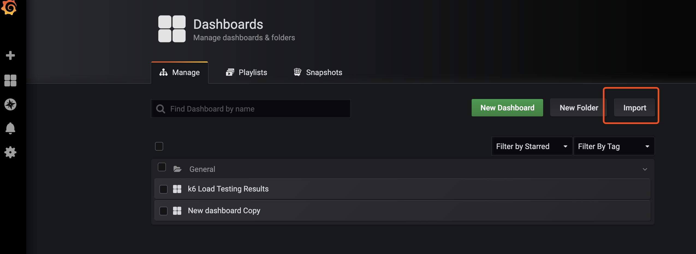
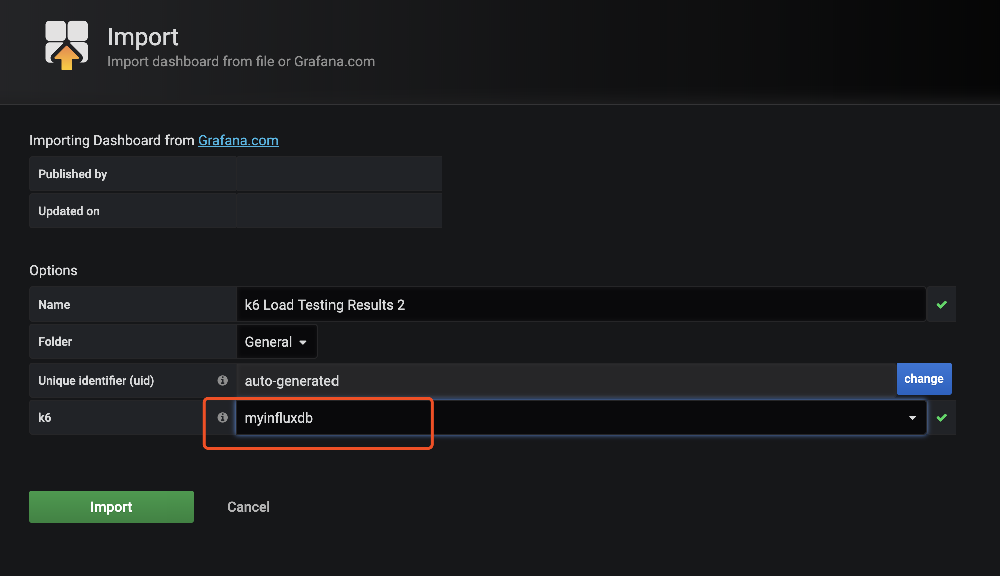
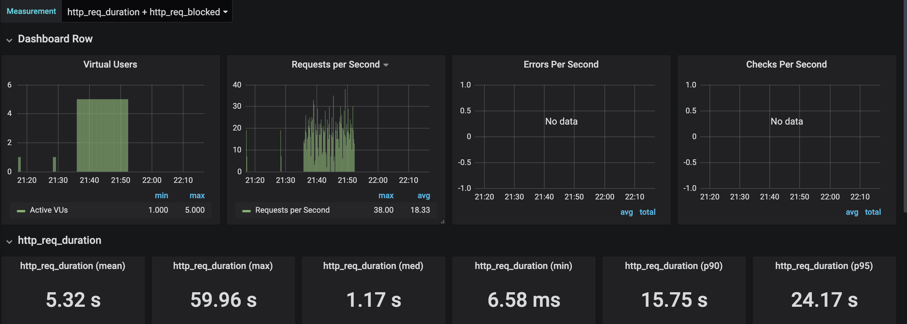
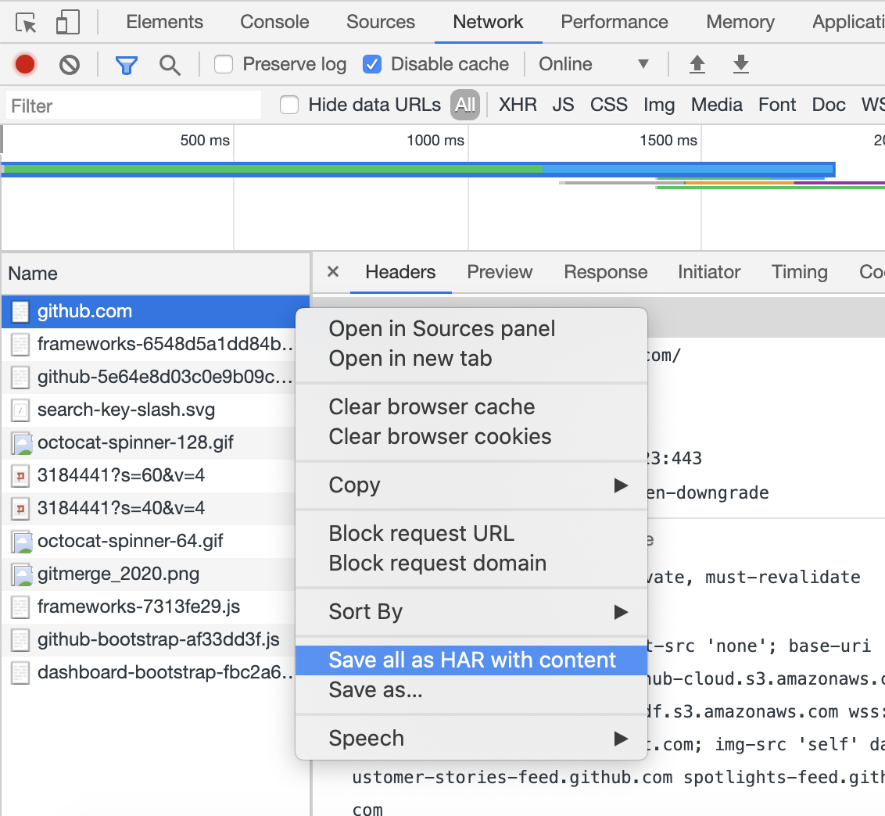

k6 是一款用于性能测试工具，本文档整理了一组 docker-compose 用于可视化。

## 使用步骤

启动 influxdb 和 grafana 服务  docker-compose up -d influxdb grafana

配置 grafana 面板 ，访问 http://localhost:3000/?orgId=1

导入预设置的面板

选择数据源

选择 k6-load-testing-results_rev3.json 配置文件，导入成功后能看到图表。

第一次导入应该没有数据，现在可以去准备脚本。有两种方式，一是自己编写，另外一种是使用 HAR 文件转换。这里讲解 HAR 文件的方式。

使用 

> k6 convert --output samples/github.js github.com.har 

运行k6测试 docker-compose run --rm k6 run /scripts/github.com.js

然后在grafana 中就能看到图表了。